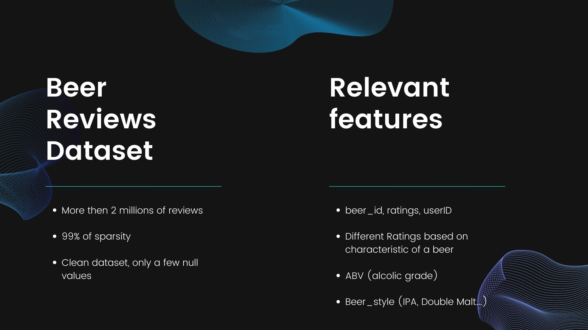

# Beer Recommendation System Data Science Analysis
Big data project about recommendation Systems  (grade 30)

## What is a recommender system ?
Tool that make recommendations for the users to help them in their choices

There are two types of recommender system : Collaborative Filtering and Content Based Filtering.
*Content Based Filtering*  : Makes suggestions based on description of the item and a profile of the user's preferences.
*Collaborative filtering* : Gives recommendations using only information about rating profiles for different users or items (behaviour of people)

## Project Goals

### Data Analisys 
Analisis of the single features, data sparcity, statistics

### Recommender system multi-approach
Build recommender system with different approach, Alternating Least of Squares  and Single Value Decomposition for Collaborative filtering. Cosine similarty for Content based

### Web reccomander system 
Building a web app with python and streamlit using content based model

 

 

 

 

 

 

 

 

 

 

 

 

 

 

 

 

 

 

 

 

 
